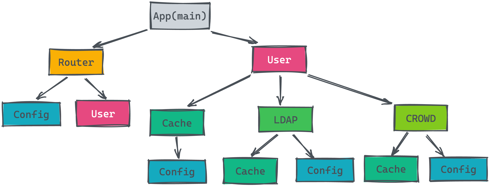

# Dependency Injection in Go

[Wire](https://github.com/google/wire) is a code generation tool that automates connecting components using dependency injection.



## Install

```sh
go install github.com/google/wire/cmd/wire@latest
```

and ensuring that `$GOPATH/bin` is added to your `$PATH`.

## Code Generate

```sh
wire gen ./...
```
