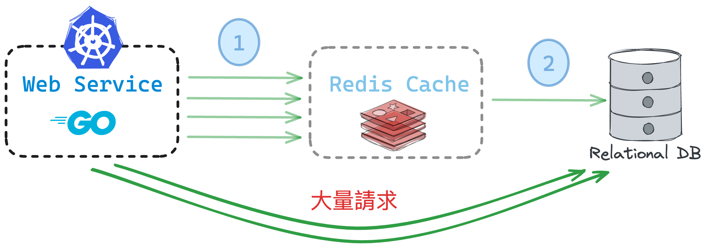

# Using singleflight in Go language to solve Cache Hotspot Invalid

## Introduction

In the process of using cache, we often encounter the problem of cache hotspot invalidation. When the cache is invalid, multiple requests will be sent to the database at the same time, causing the database to be overwhelmed. In order to solve this problem, we can use the singleflight mechanism to solve the problem of cache hotspot invalidation.

## Singleflight

Singleflight is a mechanism that can ensure that only one request is sent to the database at the same time. When multiple requests are sent to the database at the same time, only one request is sent to the database, and the other requests are waiting for the result of the request. When the request is completed, the result is returned to the waiting request.

See the [blog post](https://blog.wu-boy.com/2024/02/how-to-reslove-the-hotspot-invalid-using-singleflight-en/) for more details.
